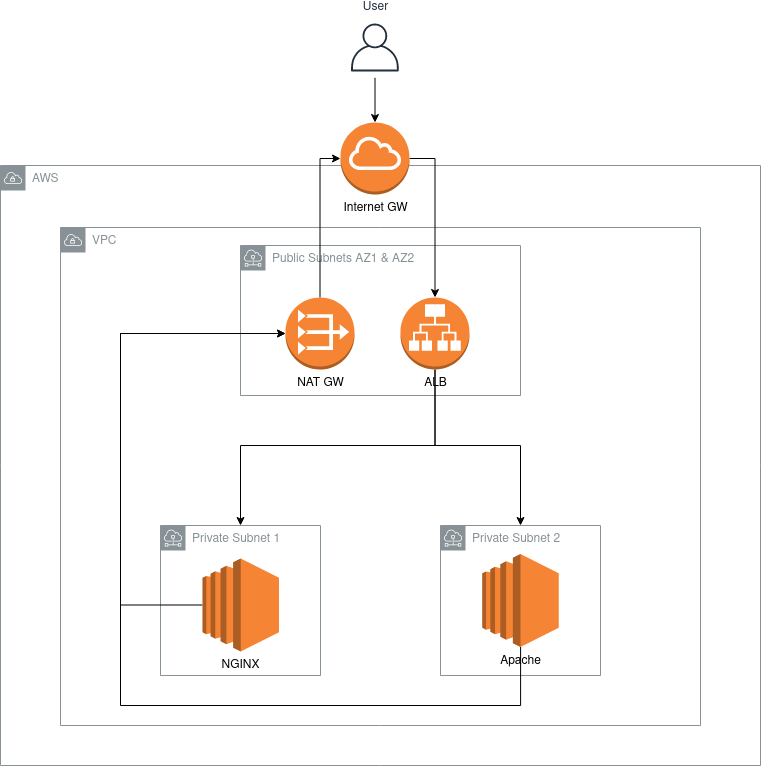

# terraform-aws-exercise
Exercise that involves creating an ALB and two EC2 instgances with NGINX and Apache.

## Usage

Log in to AWS with your IAM credentials and execute `terraform init && terraform apply`.

After the infrastructure has been deployed, just do `curl $ALB_URL` replacing $ALB_URL with the URL shown as output after applying the Terraform scripts. If the ALB doesn't respond instantly after applying the Terraform scripts, please wait a minute until EC2 instances and target group finish initializing.

You'll find a .pem file (created after apply) to connect to the EC2 instances if needed, in `modules/my-web-app/ec2_private_key.pem`. These are in private subnets, so you'll need to create a bastion host or Cloud9 instance in a public subnet if you want to connect to them via SSH.

## Architecture

The architecture consists in an ALB located in two public subnets, and two EC2 instances located in private subnets. One of the EC2 instance has NGINX installed and the other one, Apache. The ALB has a listener in port 80 and forwards requests to these two EC2 instances to port 80, so some requests to the ALB will show you an NGINX start page and some will show an Apache start page because of load balancing. Also, these EC2 instances have outbount internet access through a NAT Gateway in order to install NGINX and Apache during their inicialization.

Here is a architecture diagram:

  

